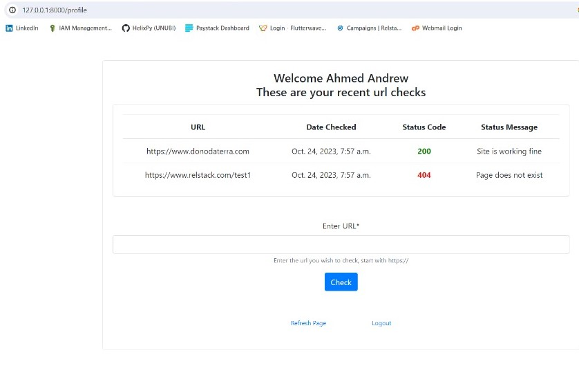

# Manual Cronjob

> One paragraph statement about the project.

Additional description about the project and its features.

## Built With

- Python
- Django
- Bootstrap

## Getting Started

****
**Modify this file to match your project, remove sections that don't apply. For example: delete the testing section if the currect project doesn't require testing.**

To get a local copy up and running follow these simple example steps.

### Prerequisites

### Setup

### Install

### Usage

### Deployment

## Authors

👤 **Unubi Opaluwa**

- GitHub: [@githubhandle](https://github.com/HelixPy/)
- Twitter: [@twitterhandle](https://twitter.com/unubi_)
- LinkedIn: [LinkedIn](https://linkedin.com/in/unubi-opaluwa)

